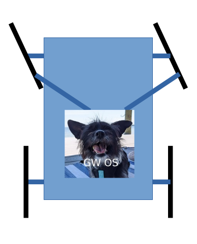
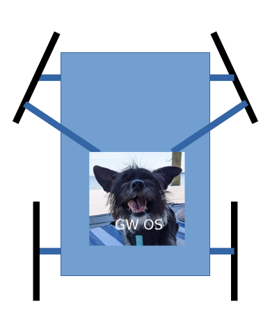
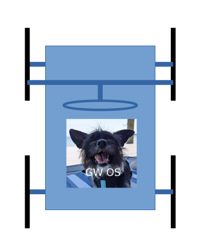

# System Structure

<div class="center">

**Gabe Parmer**

© Gabe Parmer, 2024, All rights reserved

</div>

---

# Abstraction

A simplified representation
- Omits details
- Encodes operations and abstractions over local state

Implemented in a **module/component**

---

## Abstraction Examples

- Filesystem
- Socket
- File descriptor
- Virtual Memory
- Thread
- Process
- Databases
- DOM
- ...

---

## Abstraction Properties

1. Interface
   - Programmer mechanism(s) to leverage abstraction
2. Implementation
   - Details of how the abstraction is provided
3. Resource interface
   - How the abstraction updates system resources

---

## Abstraction Properties

1. Interface - Programmer mechanism(s) to leverage abstraction
   - FS?
   - Process?
   - Virtual Memory?
   - DB?
2. Implementation - Details of how the abstraction is provided
3. Resource interface - How the abstraction updates system resources

---

## Abstraction Properties

1. Interface - Programmer mechanism(s) to leverage abstraction
2. Implementation - Details of how the abstraction is provided
3. Resource interface - How the abstraction updates system resources
   - FS?
   - DB?

```c []
struct sched_param sp;
sp.sched_priority = 10;
sched_setparam(getpid(), &sp);
```

---

## Shallow vs. Deep Components

How **wide** is the interface relative to the implementation?

- Narrow interface w/ significant implementation
  - Hides significant complexity
  - Organizes significant state

- Wide interface
  - Exposes more details about the implementation
  - Doesn't hide the complexity as much

**Deep components provide stronger abstraction**  <!-- .element: class="fragment" data-fragment-index="1" -->

---

## Shallow vs. Deep: Analogy


---

## Shallow vs. Deep: Analogy



---

## Shallow vs. Deep: Analogy



---

## Shallow vs. Deep: Analogy




---

## Depth of Abstraction

<div class="center">

```mermaid
flowchart TD
	A(Client)
	B(Block Abstraction)
	C(Disk Driver)

	A --> B
	B --> C
```

</div>

Disk driver:
- Interface: block read/write
- Implementation: interrupts, DMA, registers

---


```c [1-3|5-14|11-13]
/* Block Abstraction */
int block_read(int offset, char *block);
int block_write(int offset, char *data);

/* Client Code */
void client(void)
{
	char block[4096];
	char *msg = "hello world";

	if (block_read(10, block) < 0) err();
	strncpy(block, msg, strlen(msg) + 1);
	if (block_write(10, block)) err();
}
```


Notes:
- What if we're preempted before the write, and someone else modifies the block?
- How does this interface differ from a SSD device driver?

---

## Abstraction Width

The *width* of the `block_*` abstraction is very small.
- But provides little *abstraction*

Examples of similar abstractions:
- [`virtio_blk`](https://projectacrn.github.io/latest/developer-guides/hld/virtio-blk.html)
- Linux [Logical Volume Manager](https://en.wikipedia.org/wiki/Logical_Volume_Manager_(Linux)) (LVM)
- [Exokernel](https://pdos.csail.mit.edu/papers/exo-sosp97/exo-sosp97.html) block interface

---

## Abstraction Width

Interface to DBs?
- SQLite: `sqlite_exec(db_conn, "sql command...", ...)`
- Postgres: `PQexec(db_conn, "sql command...")`

Interface width $\neq$ number of functions <!-- .element: class="fragment" data-fragment-index="1" -->
- DB interface includes a full-fledged language  <!-- .element: class="fragment" data-fragment-index="1" -->

---

## Shallow vs. Deep Components

Be wary of nuance in how you think about this.

---

## Deep Components

Unix Virtual File System Abstraction
- remarkably small API for a ton of functionality
- see the [xv6](https://github.com/gwu-cs-advos/xv6-riscv) source

```c []
int open(const char *pathname, int flags, mode_t mode);
off_t lseek(int fd, off_t offset, int whence);
ssize_t write(int fd, const void buf[], size_t count);
ssize_t read(int fd, void buf[], size_t count);
int close(int fd);
```

---

## Deep Components - Semantic Gap

Risk of deep components: The abstraction makes some actions impossible
- What if we want two files to share some blocks?
- What if we want to [share some of the page-tables](https://lwn.net/Articles/895217/) between processes?
- What if we want to [directly talk to devices](https://www.dpdk.org/) at user-level?

Semantic gap - If a task requires capabilities hidden and made inaccessible by the abstraction.  <!-- .element: class="fragment" data-fragment-index="1" -->

---

## Deep Component - Networking Example

`socket`s augment the VFS API to enable network communication

- Streaming enables TCP/IP, without needing to know the details
- But one can also use UDP if they require more per-packet control

---

## Shallow Components

Expose *internal implementation details* in the interface

- Example: an interface close to that of a data-structure
  - Linked list API, `block_*` interface w/ simple implementation
- Prevent updates to the component
- Requires client to care about irrelevant details

Leaky abstractions - an abstraction that reveals or requires client to have knowledge of implementation details.  <!-- .element: class="fragment" data-fragment-index="1" -->

---

## Width of Interface

Default design goal:

1. Deep component, narrow interface
2. Optimized interface for *common case* usage
   - For example, avoid whatever led to Java's `FileInputStream`, `BufferedInputStream`, I/O mess
3. Extend interface for more control (to avoid semantic gap) where necessary

---

## Deep Component with Shallow Extension

```c []
int ioctl(int fd, unsigned long op, ...);
```

> Arguments,  returns, and semantics of ioctl() vary according to the device driver in question (the call is used as a catch-all for operations that don't cleanly fit the UNIX stream I/O model). - Manual page for `ioctl`

- Vague, explicitly "cuts through" the abstraction
- Specific, by design, and not general

---

## Shallow Extension w/ Leakage

```c []
void *mmap(void *addr, size_t length, int prot, int flags, int fd, off_t offset);
```

- Extension enables elision of system calls for file modifications
- Doesn't work on any `fd`, provides memory that doesn't behave like memory
- Have to understand what's happening in the abstraction
  - only works on files
  - relies on eagerly created file contents (cannot `mmap` "files" in `/proc/`)

---

##

---

##

---

##
